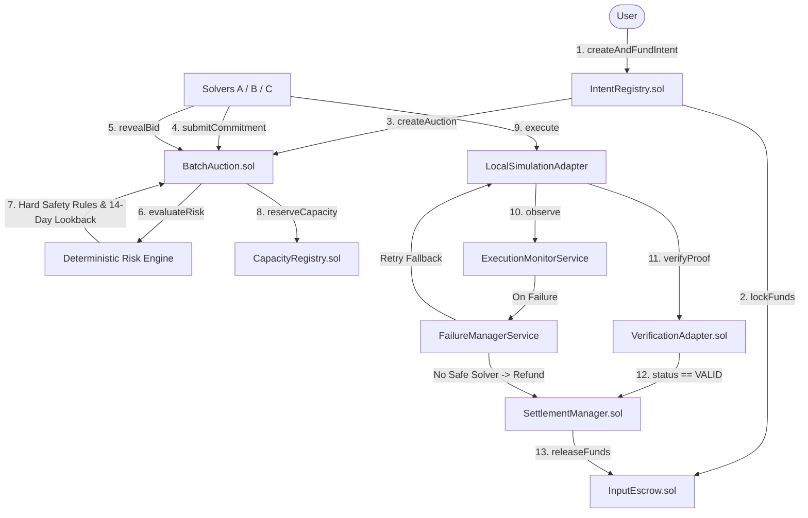

# IntentMesh — Autonomous Cross-Chain Intent Settlement Protocol

## One-line Description
A security-first, cross-chain intent settlement protocol featuring sealed commit-reveal auctions, a 14-day deterministic risk engine, independent proof verification, and automated failure recovery.

---

## Problem Statement
**CSI ORIGIN 2026 Problem Statement #10**: Address the trust, latency, slippage, and execution failure challenges inherent in cross-chain multi-step transactions. Existing bridges and bridge aggregators rely on fragile imperative routing steps, exposing user funds to front-running, high slippage, unverified execution, and single-point-of-failure solver bottlenecks.

---

## Problem We Solve
Traditional cross-chain protocols force users to specify exact execution paths across bridges and DEXs. If a step fails mid-flight, funds become stuck or lost. Furthermore, relying on centralized relayers or single solvers creates trust assumptions and liquidity lockups without guaranteed execution quality or automatic fallback mechanisms.

---

## Our Solution
**IntentMesh** is a trust-minimized, outcome-based cross-chain intent execution marketplace:
- **Outcome Specification**: Users specify *what* outcome they want (`minOutputAmount`, `destinationChainId`, `destinationToken`, `recipient`, `deadline`) rather than *how* to execute it.
- **Sealed Solver Competition**: Independent solvers compete via cryptographically sealed commit-reveal batch auctions.
- **Deterministic Risk Engine**: Solver quotes are scored deterministically using a 5-factor model and a 14-day primary lookback policy.
- **Verification-Gated Settlement**: User funds remain locked in `InputEscrow.sol` until an independent 7-point cryptographic proof of delivery is verified on the destination chain (`NO VERIFICATION -> NO SETTLEMENT`).
- **Automated Fallback Recovery**: If a solver fails or times out, the protocol automatically selects the next best revealed bidder or executes a contract-authorized refund.

---

## Key Features

- **Outcome-Based Intent Model**: 11-field canonical intent hash binding (`IntentRegistry.sol`).
- **Input Asset Escrow**: SafeERC20 token locking with per-intent accounting (`InputEscrow.sol`).
- **Sealed Commit-Reveal Auctions**: Bounded batch auctions (`MAX_BIDS_PER_AUCTION = 32`) to prevent front-running (`BatchAuction.sol`).
- **Deterministic Risk Engine**: 5-factor scoring model (Reliability, Fill rate, Failure/timeout rate, Latency, Coverage) with **14-day primary lookback** (expanding to 90 days if sample $< 5$) and Hard Safety Rules.
- **Local EVM Execution**: Dual local Anvil chain environments (`LOCAL SOURCE CHAIN` 31337 $\rightarrow$ `LOCAL DESTINATION CHAIN` 31338).
- **Independent Verification**: 7-point checklist verification (`VerificationAdapter.sol` & `@intentmesh/verification-sdk`).
- **Proof Replay Protection**: Nonce tracking and proof uniqueness enforcement (`INVARIANT-007`).
- **Settlement Protection**: Payout triggered strictly upon valid verification (`INVARIANT-008`).
- **Automated Fallback Recovery**: Real-time failure detection, solver failure logging in `ReputationRegistry.sol`, automatic fallback candidate selection, and contract-authorized user refund.
- **AI Non-Authority Boundary**: AI components provide non-authoritative advisory observations only (`INVARIANT-010`).

---

## End-to-End Workflow

### 1. Golden Path Flow
```
User Intent
  ↓
Validation & Nonce Check
  ↓
Input Asset Escrow Lock (1000 USDC)
  ↓
Solver Discovery & Commit-Reveal Auction
  ↓
Deterministic Risk Engine Assessment (14-Day Lookback)
  ↓
Deterministic Winner Finalization & Winner Capacity Reservation
  ↓
Destination Fulfillment Execution (Local Chain 31338)
  ↓
7-Point Independent Verification Checklist (VALID)
  ↓
Settlement Authorized & Escrow Payout to Winner
```

### 2. Failure Recovery & Fallback Flow
```
Primary Solver Execution Submitted
  ↓
Execution Failure or Timeout Detected on Chain
  ↓
ExecutionMonitorService Records Failure Event in ReputationRegistry
  ↓
Capacity Reservation Released & Primary Solver Disqualified
  ↓
FailureManagerService Evaluates Remaining Revealed Bids
  ↓
Fallback Solver Selected & Execution Retried
  ↓
7-Point Verification Checklist (VALID)
  ↓
Settlement Completed with Fallback Solver
```

### 3. Contract Refund Flow
```
Execution Failure Detected & All Fallback Solvers Disqualified / Unavailable
  ↓
FailureManagerService Confirms No Safe Solver Remaining
  ↓
SettlementManager.sol Authorizes Deterministic Contract Refund
  ↓
InputEscrow.sol Refunds Input Tokens Back to User Depositor
```

---

## Architecture Diagram



---

## Security Architecture & AI Safety Boundary

| Authority Level | Layer / Module | Authority Description |
| :--- | :--- | :--- |
| **Financial / Protocol Authority** | Smart Contracts (`InputEscrow`, `SettlementManager`, `BatchAuction`) | **Authoritative**. All fund movements, capacity locks, and state transitions execute strictly via deterministic contract rules. |
| **Execution Validity Authority** | `VerificationAdapter.sol` & `@intentmesh/verification-sdk` | **Authoritative**. Enforces `NO VERIFICATION -> NO SETTLEMENT`. Checks 7 destination chain proof criteria. |
| **Risk Assessment Authority** | `@intentmesh/risk-engine` | **Authoritative**. Computes 100% reproducible numerical risk scores and enforces Hard Safety Rules. |
| **Orchestration Layer** | `apps/api/`, `ExecutionMonitor`, `FailureManager` | **Orchestration Only**. Manages local execution workflows and fallback routing. Cannot directly move escrow funds. |
| **Indexing & Presentation** | `services/indexer/`, `apps/web/` | **Presentation Only**. Formats timeline events and displays visual metrics. |
| **AI Advisory Boundary** | AI Decision Models | **STRICTLY ADVISORY (INVARIANT-010)**. AI models have ZERO authority over state changes, fund releases, refunds, capacity locks, bond slashing, or winner selection. |

---

## Solver Competition Model

IntentMesh includes three demo software solver agents under `solvers/`:
- **Solver A — Reliable (`solvers/solver-a/agent.ts`)**: Conservative parameters (3% output boost, 60s execution time). High reliability score.
- **Solver B — Fast (`solvers/solver-b/agent.ts`)**: Speed-oriented parameters (2% output boost, 15s execution time). Fast execution.
- **Solver C — Risky (`solvers/solver-c/agent.ts`)**: Aggressive output parameters (5% output boost, 120s execution time). Provides highest expected output while strictly adhering to protocol safety rules.

---

## Risk Engine & Historical Lookback Policy

The Deterministic Risk Engine (`packages/risk-engine/`) evaluates solvers across 5 weighted factors:
1. **Solver Reliability** ($30\%$): Ratio of successful fills over total attempts.
2. **Success Rate** ($25\%$): Percentage of non-failed executions.
3. **Timeout Rate** ($20\%$): Absence of execution timeouts.
4. **Execution Latency** ($15\%$): Average fulfillment speed relative to benchmark.
5. **Capacity & Bond Coverage** ($10\%$): Declared capacity and bond collateral relative to intent size.

### Historical Lookback Strategy
- **Primary Lookback**: Inspects solver execution history over the most recent **14 days**.
- **Fallback Expansion**: If the 14-day sample count is $< 5$, analysis automatically expands to **90 days** to ensure statistical sufficiency.
- Returns metadata: `{ lookbackDays, sampleCount, evidenceSufficient }`.

---

## Execution, Verification & Settlement

- **Local Cross-Chain Execution**: Uses two local Anvil EVM environments (`LOCAL SOURCE CHAIN` 31337 and `LOCAL DESTINATION CHAIN` 31338). Executes real local transactions and generates genuine transaction receipts.
- **7-Point Verification Checklist**:
  1. $\checkmark$ Intent Hash Cryptographically Bound
  2. $\checkmark$ Destination Chain ID Match (31338)
  3. $\checkmark$ Destination Token Address Match
  4. $\checkmark$ Recipient Address Match
  5. $\checkmark$ Delivered Amount $\ge$ Minimum Output Amount
  6. $\checkmark$ Destination Transaction Status == `CONFIRMED`
  7. $\checkmark$ Proof Uniqueness Enforced (`INVARIANT-007`)
- **Settlement Rule**: `NO VALID VERIFICATION -> NO SETTLEMENT`. `SettlementManager.sol` triggers `InputEscrow.releaseFunds` **only** when `VerificationAdapter` returns status `VALID`.

---

## Technology Stack

- **Smart Contracts**: Solidity 0.8.24, OpenZeppelin v5, Foundry (`forge`, `anvil`)
- **Core Languages**: TypeScript (ES2022, NodeNext), Node.js v20+
- **Monorepo Package Manager**: `pnpm` (Workspace architecture)
- **Frontend Infrastructure**: HTML5, Vanilla CSS (Dark mode / Glassmorphism), Vite
- **Testing Tools**: Foundry Test Suite, Node.js Assert Module, Custom E2E MVP Runner

---

## Repository Structure

```
.
├── .github/workflows/ci.yml   # GitHub Actions DevSecOps CI/CD Pipeline
├── apps/
│   ├── api/                   # Backend REST & SSE API Server
│   └── web/                   # Web Dashboard UI & Interactive Demos
├── contracts/                 # Solidity 0.8.24 Foundry Smart Contracts
│   ├── src/                   # IntentRegistry, InputEscrow, SolverRegistry, BatchAuction, SettlementManager
│   └── test/                  # 61 Foundry tests (100% passing)
├── docs/
│   ├── ARCHITECTURE.md        # Core Protocol Architecture
│   ├── AUCTION.md             # Sealed Commit-Reveal Auction Specification
│   ├── CONTRACTS.md           # Smart Contract Specification Matrix
│   ├── PHASED_PLAN.md         # Protocol Phased Implementation Plan
│   ├── PROBLEM_STATEMENT_MAPPING.md # CSI PS #10 Traceability Matrix
│   ├── PROTOCOL_INVARIANTS.md # Formal Protocol Invariants Matrix
│   └── STATE_MACHINE.md       # Canonical Protocol State Machine
├── packages/
│   ├── chain-adapters/        # Local EVM Anvil Simulation Adapter
│   ├── intent-schema/         # Canonical Intent Schemas
│   ├── protocol-types/        # Canonical TypeScript Type Definitions
│   ├── risk-engine/           # Deterministic Risk Engine (14-Day Lookback)
│   ├── solver-sdk/            # Keyless Solver Client & Eligibility Engine
│   └── verification-sdk/      # 7-Point Cryptographic Verification Engine
├── services/
│   ├── execution-monitor/     # Real-time Execution Monitoring Service
│   ├── failure-manager/       # Fallback & Failure Recovery Manager
│   └── indexer/               # On-chain Event Indexer
└── solvers/                   # Solver Agents (Solver A / Reliable, Solver B / Fast, Solver C / Risky)
```

---

## Installation & Running Locally

### 1. Prerequisites
- Node.js >= v20
- pnpm >= v9
- Foundry (`forge`)

### 2. Portable Installation & Build
```bash
# Install dependencies
pnpm install

# Compile Smart Contracts
cd contracts
forge build

# Build all Workspace TypeScript Packages
cd ..
npx tsc --build --force packages/protocol-types packages/intent-schema packages/solver-sdk packages/risk-engine packages/chain-adapters packages/verification-sdk services/execution-monitor services/failure-manager services/indexer apps/api solvers
```

---

## Interactive Demos

### Option A: Command Line Master Acceptance Suite
Run the master E2E test script testing Golden Path, Failure Recovery, and Refund flows:
```bash
pnpm demo
```

### Option B: Web Dashboard Master Demo
1. Start the Web Dashboard:
   ```bash
   pnpm dev:web
   ```
2. Open `http://localhost:5173` in your browser.
3. Click the interactive demo buttons:
   - **`[▶ Run Golden Path Demo]`**: Demonstrates successful 12-step cross-chain intent execution and settlement.
   - **`[⚡ Run Failure Recovery Demo]`**: Demonstrates primary solver failure, detection, automatic fallback to Solver B, retry, verification, and settlement.
   - **`[↩ Run Contract Refund Demo]`**: Demonstrates failure fallback exhaustion leading to contract-authorized user refund.

---

## Testing Matrix

| Test Suite | Framework | Total Tests | Pass Count | Status |
| :--- | :--- | :--- | :--- | :--- |
| **Smart Contract Unit & Security** | Foundry (`forge`) | 61 | 61 | **PASS (100%)** |
| **Fuzz & Invariant Testing** | Foundry (`forge`) | 4 suites (256 runs/ea) | 4 | **PASS (100%)** |
| **TypeScript Workspace Compilation** | `tsc --build` | 11 packages/services | 11 | **PASS (100%)** |
| **SDK & Solver Agent Unit Tests** | Node.js Test Runner | 6 scenarios | 6 | **PASS (100%)** |
| **Master E2E MVP Acceptance Suite** | Custom E2E Runner | 3 master scenarios | 3 | **PASS (100%)** |

---

## DevSecOps Pipeline

The repository includes a GitHub Actions CI pipeline (`.github/workflows/ci.yml`) configured for Linux runners:
1. Repository checkout (`actions/checkout@v4`)
2. Node.js & pnpm setup (`actions/setup-node@v4`, `pnpm/action-setup@v3`)
3. Foundry toolchain installation (`foundry-rs/foundry-toolchain@v1`)
4. Solidity formatting audit (`forge fmt --check`)
5. Smart contract build (`forge build`)
6. Foundry unit & invariant testing (`forge test -vvv`)
7. Workspace TypeScript compilation (`tsc --build`)
8. Master E2E MVP Acceptance Test Suite (`node tests/e2e/run_e2e_mvp_test.js`)
9. Web Frontend Build (`pnpm --filter @intentmesh/web build`)

---

## Problem Statement Traceability

| PS #10 Requirement | IntentMesh Implementation | Primary Component | Status |
| :--- | :--- | :--- | :--- |
| User Outcome Specification | 11-field intent hash binding & outcome params | [`IntentRegistry.sol`](file:///c:/Users/lokir/OneDrive/Mosaic%20X/contracts/src/IntentRegistry.sol) | **VERIFIED** |
| Independent Solver Ecosystem | Solver registration, state management, capabilities, and bond collateral | [`SolverRegistry.sol`](file:///c:/Users/lokir/OneDrive/Mosaic%20X/contracts/src/SolverRegistry.sol) & [`SolverBondManager.sol`](file:///c:/Users/lokir/OneDrive/Mosaic%20X/contracts/src/SolverBondManager.sol) | **VERIFIED** |
| Competitive Sealed Bidding | Commit-reveal batch auction (`MAX_BIDS_PER_AUCTION = 32`) | [`BatchAuction.sol`](file:///c:/Users/lokir/OneDrive/Mosaic%20X/contracts/src/BatchAuction.sol) | **VERIFIED** |
| Multi-Factor Risk Assessment | 5-factor scoring model with 14-day lookback & Hard Safety Rules | [`packages/risk-engine/`](file:///c:/Users/lokir/OneDrive/Mosaic%20X/packages/risk-engine/src/engine.ts) | **VERIFIED** |
| Cross-Chain Fulfillment | Local EVM simulation adapters executing real transactions on local Anvil nodes | [`packages/chain-adapters/`](file:///c:/Users/lokir/OneDrive/Mosaic%20X/packages/chain-adapters/src/index.ts) | **VERIFIED** |
| Independent Verification | 7-point checklist verification (`NO VERIFICATION -> NO SETTLEMENT`) | [`VerificationAdapter.sol`](file:///c:/Users/lokir/OneDrive/Mosaic%20X/contracts/src/VerificationAdapter.sol) | **VERIFIED** |
| Escrow & Settlement | SafeERC20 asset locking & authorized payout upon valid proof | [`InputEscrow.sol`](file:///c:/Users/lokir/OneDrive/Mosaic%20X/contracts/src/InputEscrow.sol) & [`SettlementManager.sol`](file:///c:/Users/lokir/OneDrive/Mosaic%20X/contracts/src/SettlementManager.sol) | **VERIFIED** |
| Failure Recovery & Fallback | Automated failure detection, solver failure logging, fallback solver retry, and refund | [`services/execution-monitor/`](file:///c:/Users/lokir/OneDrive/Mosaic%20X/services/execution-monitor/src/index.ts) & [`services/failure-manager/`](file:///c:/Users/lokir/OneDrive/Mosaic%20X/services/failure-manager/src/index.ts) | **VERIFIED** |

---

## Team Details

- **Team Name**: [finova]
- **Team Members**: [lokireddy amrutha reddy,mutyala saathvi reddy,chinnam pavan sai]
- **Institution / Organization**: [chennai institute of technology]
- **Hackathon**: CSI ORIGIN HACKATHON 2026
- **Problem Statement**: Problem Statement #10 — Cross-Chain Intent Execution Protocol

---

## Known Limitations & Future Scope

### Known Limitations
- **Local EVM Simulation**: Cross-chain execution environments operate on local Anvil simulation instances (`LOCAL SOURCE CHAIN` 31337 and `LOCAL DESTINATION CHAIN` 31338). Real EVM transactions and receipts are generated, but production cross-chain bridge integrations (e.g., LayerZero, Chainlink CCIP) remain future work.
- **AI Non-Authority**: AI decision models provide non-authoritative advisory badges only and possess 0 protocol state authority.

### Future Scope
- Integration with live production cross-chain messaging bridges (LayerZero V2, Hyperlane, CCIP).
- Mainnet contract deployment and multi-sig administration.
- Advanced ZK-proof generation for zero-knowledge destination execution verification.
